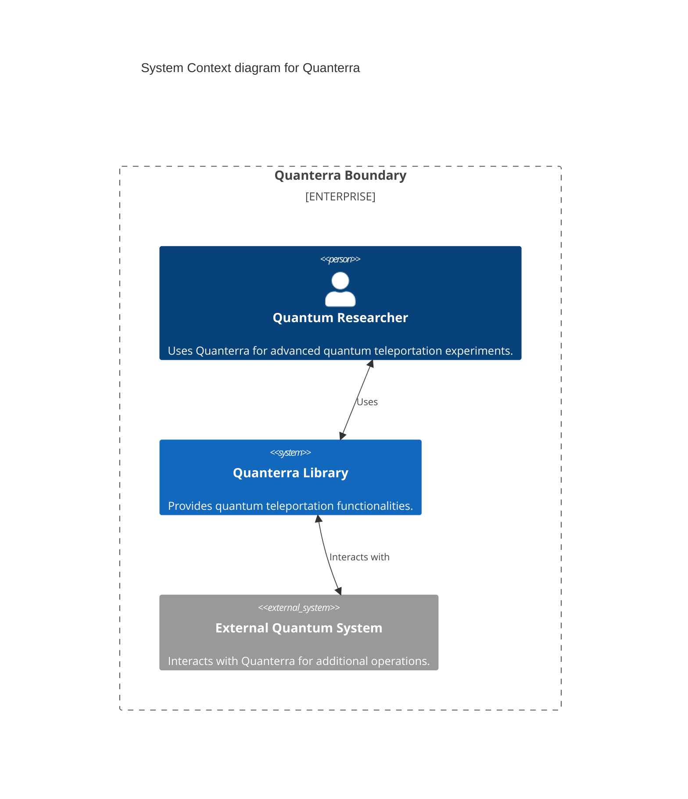
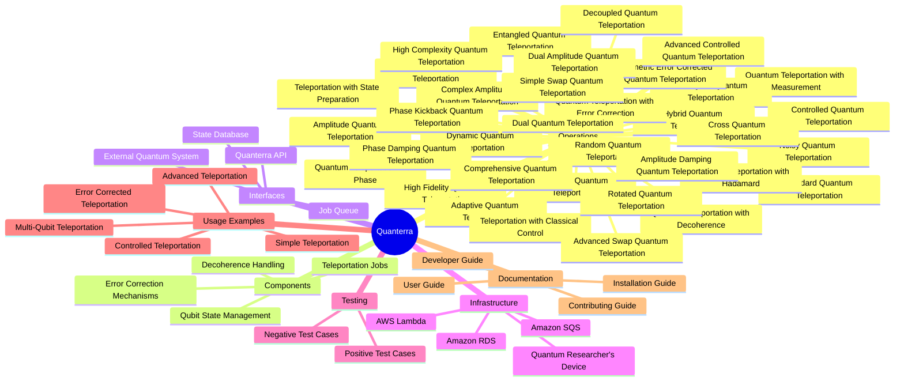
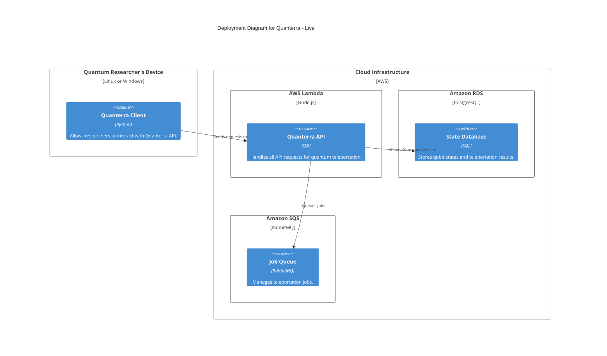

# Quanterra
Providing a comprehensive suite of quantum teleportation operations and utilities, Quanterra is designed for quantum researchers and developers to experiment with various teleportation protocols, error correction mechanisms, and quantum state management techniques. (0.2 Under Development)

## Why Quanterra?

## Architecture of Quanterra

## Operations
- Standard Quantum Teleportation: Basic teleportation operation.
- Quantum Teleportation with Measurement: Includes measurement of the teleported qubit.
- Multi-Qubit Quantum Teleportation: Handles teleportation of multiple qubits simultaneously.
- Controlled Quantum Teleportation: Uses control qubits to manage teleportation.
- Multi-Controlled Quantum Teleportation: Extends controlled teleportation with multiple control qubits.
- Random Quantum Teleportation: Introduces randomness in the teleportation process.
- Complex Quantum Teleportation: Advanced teleportation with complex operations.
- Noisy Quantum Teleportation: Simulates teleportation in a noisy environment.
- Dynamic Quantum Teleportation: Adapts teleportation protocol dynamically.
- Hybrid Quantum Teleportation: Combines multiple teleportation techniques.
- Entangled Quantum Teleportation: Uses entangled qubits for teleportation.
- Quantum Teleportation with Phase: Applies phase shifts during teleportation.
- Quantum Teleportation with Hadamard: Utilizes Hadamard gates in teleportation.
- Amplitude Quantum Teleportation: Adjusts qubit amplitudes during teleportation.
- Phase Damping Quantum Teleportation: Manages phase damping effects.
- Amplitude Damping Quantum Teleportation: Handles amplitude damping in qubits.
- Quantum Teleportation with Error Correction: Integrates error correction mechanisms.
- Quantum Teleportation with Decoherence: Addresses decoherence issues.
- High Fidelity Quantum Teleportation: Ensures high fidelity in teleportation.
- Symmetric Error Corrected Quantum Teleportation: Uses symmetric error correction techniques.
- Complex Amplitude Quantum Teleportation: Deals with complex amplitude adjustments.
- Dual Amplitude Quantum Teleportation: Teleports qubits with dual amplitude corrections.
- High Complexity Quantum Teleportation: Manages highly complex teleportation scenarios.
- Advanced Controlled Quantum Teleportation: Advanced techniques for controlled teleportation.
- Adaptive Quantum Teleportation: Adapts to changing conditions during teleportation.
- Decoupled Quantum Teleportation: Decouples qubits during the teleportation process.
- Teleportation with State Preparation: Prepares qubit states before teleportation.
- Teleportation with Classical Control: Combines classical control with quantum teleportation.
- Rotated Quantum Teleportation: Applies rotations to qubits during teleportation.
- Phase Kickback Quantum Teleportation: Utilizes phase kickback effects.
- Cross Quantum Teleportation: Cross teleports between different qubits.
- Dual Quantum Teleportation: Teleports two qubits simultaneously.
- Simple Swap Quantum Teleportation: Swaps qubits in a simple manner.
- Advanced Swap Quantum Teleportation: Advanced techniques for swapping qubits.
- Comprehensive Quantum Teleportation: Covers comprehensive teleportation scenarios.

## Deploying Quanterra
